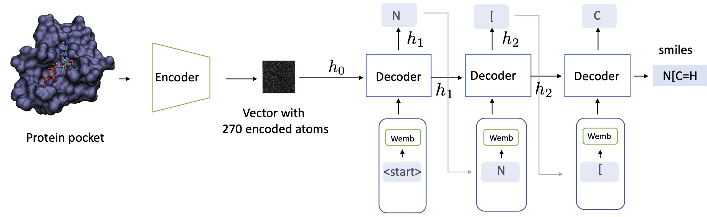
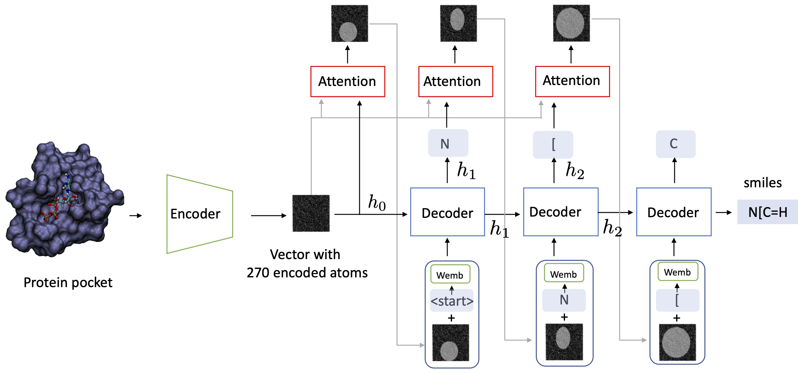

# Captioning
The goal of this project is to generate smiles for ligands using pocket information.
Pocket is encoded using Euclidean Neural Networks. Then features are given to Lstm to generate smiles. This is similar to the image captioning task. There are two implemeted options: decoder without and with attention.

## Table of Contents
1. [Installation](#Installation)
2. [Preprocessing](#Preprocessing)
3. [Files Architecture](#Files-Architecture)
3. [Encoder](#Encoder)
    1. [E3nn](#E3nn)
    2. [E3nn + Pointnet](#E3nn-+-Pointnet)
    3. [E3nn + Attention](#E3nn-+-Attention)
4. [Decoder](#Decoder)
    1. [LSTM](#LSTM)
    2. [Attention](#Attention)
5. [Training](#Training)
6. [Sampling](#Sampling)
    1. [Max Sampling](#Max-Sampling)
    2. [Random Sampling](#Random-Sampling)
    3. [Beam Search](#Beam-Search)
    4. [Temperature Sampling](#Temperature-Sampling)
    5. [Topk Sampling](#Topk-Sampling)
7. [Fine-Tuning](#Fine-Tuning)
8. [Author](#Author)


## Installation

This repository can be cloned with the following command:

```
git clone https://gitlab.ethz.ch/rethink/geneuclidean.git
```
Then change the branch to captioning
```
git checkout captioning
```
Run
```
bash envs/dependecies.sh
```
To activate the dedicated environment:
```
conda activate e3nn_sampling
```

## Preprocessing

To download the dataset run:

```bash 
bash getDataset.sh 
```

To run preprocessing script:
```
python preprocessing_all.py
```

## Files Architecture
When you have installed all dependencies and obtained the preprocessed data, you are ready to run our pretrained models and train new models from scratch.

### Directory layout                  
    ├── src                     # Source files 
    ├── img                     # Images for README 
    ├── report                  # Main captioning_repor.pdf 
    └── General_readme.md

### Source files

    ├── ...
    ├── src                 
    │   ├── model ├── encoder    #models for encoder
                  ├── decoder    #models for decoder         
    │   ├── training             #train classes
    │   ├── sampling             #sampling classes
    |   ├── visualisation        #visualisation code
    |   ├── data
    |   ├── train_captioning.py  #script to run all pipeline    
    │ 
    └── ...

## Encoder

### E3nn

### E3nn + Pointnet

### E3nn + Attention
## Decoder

### LSTM

### Attention
## Training


## Sampling
### Max-Sampling
### Random-Sampling
### Beam-Search
### Temperature Sampling
## Fine-Tuning

## Author

# Models
Model without attention. Every LSTM gets a previous hidden state and embedded caption.


Model with attention. Every LSTM gets a previous hidden state and embedded caption with attention-weighted-feature vector. On the illustration white parts of the image mean weighted features whee the Decoder should pay attention to generate the next word



#### 2. Download the dataset

```
bash getDataset.sh 
```
```
python preprocessing_all.py
```
#### 3. Preprocess dataset

```bash
   python preprocessing_all.py
```
#### 4. Training

```bash
python train.py configuration/config.json  
```

Configuration file is in configs/ folder. You may specify the path to the inputs and results, parameters of encoder and decoder, parameters of training (batch size, number of epoches). 

#### 5. Sampling

```bash
python sampling.py configuration/config.json  
```


#### 5. Results

Results (plots of train/test loss and scatter plots of predicted/target pkd) should be saved in the folder /results


<br>


