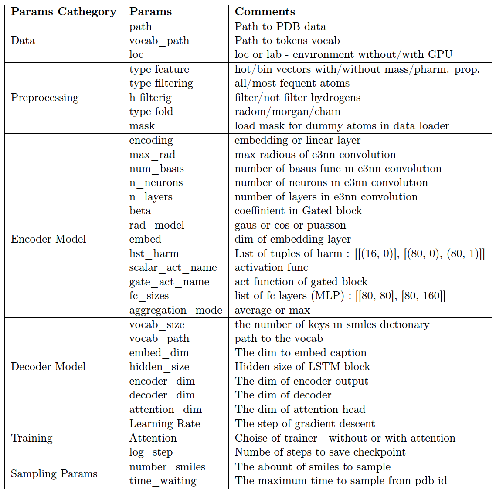
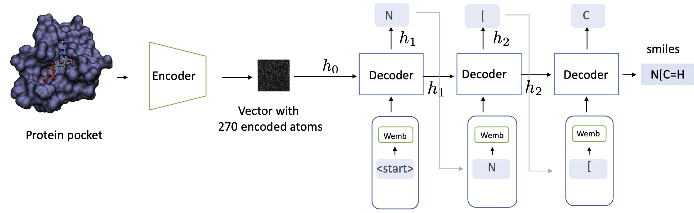
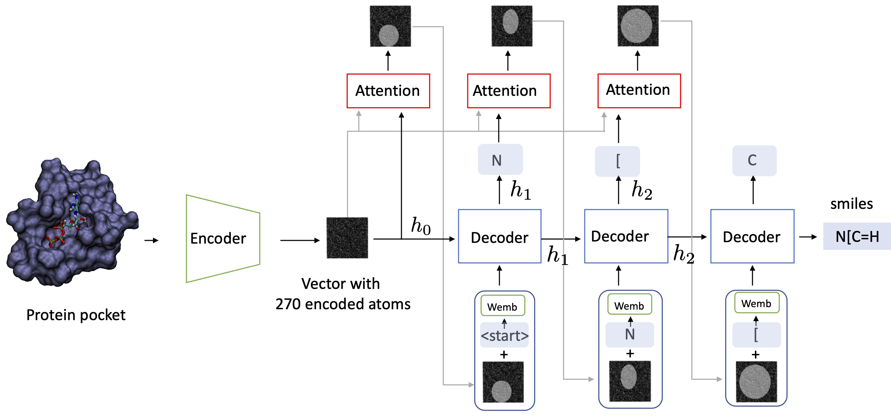

# Captioning
The goal of this project is to generate smiles for ligands using pocket information.
Pocket is encoded using Euclidean Neural Networks. Then features are given to Lstm to generate smiles. This is similar to the image captioning task. There are two implemeted options: decoder without and with attention.

## Table of Contents
1. [Installation](#Installation)
2. [Preprocessing](#Preprocessing)
3. [Files Architecture](#Files-Architecture)
4. [Training](#Training)
   1. [Training Locally](#Training-Locally)
   2. [Training on cluster](#Training-on-cluster)
   3. [Checkpoints](#Checkpoints)
   4. [Multiple jobs on cluster](#Multiple-jobs-on-cluster)
5. [Hyperparameters](#Hyperparameters)
3. [Encoder](#Encoder)
    <!-- 1. [E3nn](#E3nn)
    2. [E3nn + Pointnet](#E3nn-+-Pointnet)
    3. [E3nn + Attention](#E3nn-+-Attention) -->
4. [Decoder](#Decoder)
    <!-- 1. [LSTM](#LSTM)
    2. [Attention](#Attention) -->

<!-- 6. [Sampling](#Sampling)
    1. [Max Sampling](#Max-Sampling)
    2. [Random Sampling](#Random-Sampling)
    3. [Beam Search](#Beam-Search)
    4. [Temperature Sampling](#Temperature-Sampling)
    5. [Topk Sampling](#Topk-Sampling)
7. [Fine-Tuning](#Fine-Tuning) -->
8. [Author](#Author)


## Installation<a name="Installation"></a>

This repository can be cloned with the following command:

```
git clone https://gitlab.ethz.ch/rethink/geneuclidean.git
```
Then change the branch to captioning
```
git checkout main
```
Run
```
bash envs/dependecies.sh
```
To activate the dedicated environment:
```
conda activate e3nn_sampling
```
## Preprocessing<a name="Preprocessing"></a>

To download the dataset run:

```bash 
bash getDataset.sh 
```

To run preprocessing script:
```
python preprocessing_all.py
```

## Files Architecture<a name="Files-Architecture"></a>
When you have installed all dependencies and obtained the preprocessed data, you are ready to run our pretrained models and train new models from scratch.


### Directory layout<a name="Directory-layout"></a>

    ├── ...
    ├── src
        ├── configurations 
                  ├──bash               #bash scripts for Leonard
                  ├──config_lab         #config files for the cluster/gpu env
                  ├──config_local       #config files for local machines (CPU only)  
        ├── datasets                    #data loader / feature loader scripts
        ├── evaluation                  #statistics of  uniquness/novelty/validity & properties distributions              
        ├── model ├── encoder           #models for encoder
                  ├── decoder           #models for decoder   
        ├── preprocessing               #preprocessing to get initial data  
        ├── sampling                    #sampling classes
        ├── scripts                     #scripts to get environment e3nn_sampling
        ├── tests                       #tests for classes/ data structure
        ├── training                    #train classes
        ├── utils                       #helper functions
        ├── visualisation               #code for visualisation / movie in Pymol
        ├── data
        ├── train_all_folds.py          #script to run all pipeline for captioning 
        ├── train_binding.py            #script to run training for binding   
        ├── tran_one_fold.py            #script to run all pipeline for captioning for 1 fold
    
    └── ...


## Training<a name="Training"></a>
### Training Locally<a name="Training-Locally"></a>
To run the pipeline you can simply run:
```
python train_all_folds.py --loc=local --config=configurations/config_local/bio_e3nn/bio_e3nn_13.yaml --radious=8 --type_feature=mass_charges  --type_filtering=all --h_filterig=h --type_fold=chain
```

Parameters:
* *loc*: (local or lab) the env without and with GPU (cluster)
* *config*: the path to the model config file
* *radious*: the radious of the sphere to capture pocket's atoms
* *type_feature* (hot_simple / mass_charges / bio_properties / bio_all_properties): the type of feature to load for the training
* *h_filterig* (h / -h): h to remove hydrogens, -h t leave hydrogens
* *type_fold* (random / morgan / chain): the type of data split


### Training on cluster<a name="Training-on-cluster"></a>
```
bsub -n 8 -W 24:00 -R "rusage[mem=10000,ngpus_excl_p=1]"  -oo logs/hot_simple_bio_local_net_33  python train_all_folds.py --loc=lab --config=configurations/config_lab/bio_e3nn/bio_local_net_33.yaml --radious=8 --type_feature=hot_simple  --type_filtering=all --h_filterig=h --type_fold=random
```

### Checkpoints<a name="Checkpoints"></a>
During training you will have checkpoints to track the progress of pipeline:
* *folds.csv* contains inf about folds and type of split 
* *checkpoint_evaluation.csv* contains inf about conducted experiments and corresponding type of split, fold, epoch, id of sampled pdb

### Data Strcuture of results<a name="Data-Strcuture-of-results"></a>
During training you will have the following structure for your model:
The name of current model is: **model_name** _ **type_feature** _ **radious_type** _ **filtering** _ **h_filterig**

The layout of your model file (in the folder /results/captioning_results/model_name):

    ├──checkpoints
        ├──training              #checkpoints of encoder model on different folds and types of folds
        ├──folds.csv             #checkpoint of current epoch/fold of the model 
        ├──eval_checkpoint.csv   #checkpoint during evaluation (current fold, epoch and id of pdb)
    ├──logs                      #indexes of split
    ├──models                    #encoder / decoder torch saved models forr different epoches/folds splits
    ├──statistics                #distributions of similarity/phama properties
    ├──../tensorboard            #tain /eval losses for every epoch and type of split. Also memory consumption


### Multiple jobs on cluster<a name="Multiple-jobs-on-cluster"></a>
Run simply:
```
bash configurations/bash/file.sh
```
## Hyperparameters<a name="Hyperparameters"></a>
You can find a table of hyperparameters with commnets below:

You can find a table of optimal hyperparameters from empirical study below:

## Encoder<a name="Encoder"></a>

|Model Encoder		| Description| File (/model/encoder/...) |
| --- | ---  | --- |
|bio_net | The model takes hybrid type of inputs. Usual baseline e3nn model | [bio_e3nn.py](model/encoder/bio_e3nn.py) |
|bio_local_net | The model takes one type of inputs. Usual baseline e3nn model | [bio_e3nn.py](model/encoder/bio_e3nn.py)|
|bio_net_no_bn | bion_net model without batch normalisation | [bio_e3nn.py](model/encoder/bio_e3nn.py) |
|bio_vis_net | bio_net model without flattenning output. For decoder with attention | [bio_e3nn.py](model/encoder/bio_e3nn.py) |
|resnet_bio_local_net | bio_local_net with residual connections| [bio_e3nn.py](model/encoder/bio_e3nn.py) |
|concat_bio_local_net | bio_local_net with concaenation of different e3nn convolutions | [bio_e3nn.py](model/encoder/bio_e3nn.py) |
|pointnetall | pointnet (deep resnet) model | [e3nn_res.py](model/encoder/e3nn_res.py) |
|att_e3nn | attention in the end model | [e3nn_att.py](model/encoder/e3nn_att.py) |
|binding_e3nn | bio_net for binding (regression tasks)|  [binding_e3nn.py](model/encoder/binding_e3nn.py)  |


## Decoder<a name="Decoder"></a>
|Model Encoder		| Description| File (/model/decoder/...) |
| --- | ---  | --- |
|lstm | lstm model | [decoder.py](model/decoder/decoder.py)  |
|lstm_attention | lstm_atttention model | [decoder_vis.py](model/decoder/decoder_vis.py) |
<!-- ### E3nn -->

<!-- ### E3nn + Pointnet

### E3nn + Attention
## Decoder

### LSTM

### Attention
## Training


## Sampling
### Max-Sampling
### Random-Sampling
### Beam-Search
### Temperature Sampling
## Fine-Tuning -->

## Author<a name="Author"></a>
Daniil Emtsev (demtsev@student.ethz.ch)
<!-- # Models
Model without attention. Every LSTM gets a previous hidden state and embedded caption.


Model with attention. Every LSTM gets a previous hidden state and embedded caption with attention-weighted-feature vector. On the illustration white parts of the image mean weighted features whee the Decoder should pay attention to generate the next word
 -->


<!-- #### 2. Download the dataset

```
bash getDataset.sh 
```
```
python preprocessing_all.py
```
#### 3. Preprocess dataset

```bash
   python preprocessing_all.py
```
#### 4. Training

```bash
python train.py configuration/config.json  
```

Configuration file is in configs/ folder. You may specify the path to the inputs and results, parameters of encoder and decoder, parameters of training (batch size, number of epoches). 

#### 5. Sampling

```bash
python sampling.py configuration/config.json  
```


#### 5. Results

Results (plots of train/test loss and scatter plots of predicted/target pkd) should be saved in the folder /results -->


<br>


